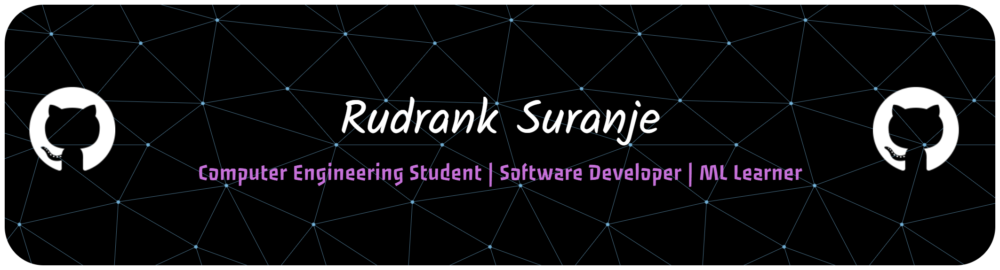

  

## 🌐 Social 

  
  
  

## 🚀 About Me

I'm a Computer Engineering student passionate about building practical software,
solving problems, and continuously exploring new technologies.

- 🎓 Computer Engineering student at PCCoE
- 💻 Building strong foundations in **C, C++, Python, and Data Structures & Algorithms**
- 🌐 Exploring **Web Development, Full-Stack Applications, and REST APIs**
- 📱 Exploring **Android Development and Kotlin**
- 🤖 Currently learning **Machine Learning**
- 🐧 Exploring **Linux and open-source technologies**
- 🚗 Interested in **Automotive Software Engineering**
- 🧩 Interested in **Software Engineering, Problem Solving, and System Design**
- 🛠️ Building academic, personal, and collaborative projects
- 🤝 Interested in open-source development and technical collaboration

> **Learn. Build. Experiment. Improve.**

## 🧠 Tech Stack

### Languages

  

### Web & Application Development

  

### Tools & Platforms

  

## 🌱 Currently Learning

  

## 🤖 Machine Learning Journey

Currently exploring Machine Learning and building a strong foundation through
Python, mathematics, data analysis, and practical experimentation.

### Currently Exploring

- 🐍 Python for Machine Learning
- 📊 Data Analysis
- 🔢 NumPy
- 🐼 Pandas
- 📈 Data Visualization
- 🧹 Data Preprocessing
- 🧠 Supervised Learning
- 📌 Classification
- 📉 Regression
- 📐 Model Evaluation
- 🔬 Practical Machine Learning Projects

  <b>Learning → Experimenting → Building → Improving</b>

## 🎯 Areas of Interest

<table align="center">
  <tr>
    <td align="center">
      💻 
      <b>Software Engineering</b>
    </td>
    <td align="center">
      🤖 
      <b>Machine Learning</b>
    </td>
    <td align="center">
      🚗 
      <b>Automotive Software</b>
    </td>
  </tr>
  <tr>
    <td align="center">
      🌐 
      <b>Web Development</b>
    </td>
    <td align="center">
      📱 
      <b>Android Development</b>
    </td>
    <td align="center">
      🐧 
      <b>Linux</b>
    </td>
  </tr>
</table>

## 💻 Selected Projects

### 🏙️ City Builder Game

A Python-based city-building game developed to explore object-oriented
programming, game logic, interactive systems, and software design.

**Tech:** Python • Object-Oriented Programming

  

### 🔢 Digit Recognition

A machine learning project focused on recognizing handwritten digits
using image data and classification techniques.

**Tech:** Python • Machine Learning • Data Processing • Classification

  

### 🏋️ Exercise Form Checker

A computer vision project designed to analyze exercise movements
and provide feedback on exercise form.

**Tech:** Python • Computer Vision • Machine Learning

  

## 📚 What I'm Working On

<table align="center">
  <tr>
    <td align="center">🧩 <b>DSA</b></td>
    <td align="center">💻 <b>Software Development</b></td>
    <td align="center">🌐 <b>Web Development</b></td>
  </tr>
  <tr>
    <td align="center">🤖 <b>Machine Learning</b></td>
    <td align="center">🐧 <b>Linux</b></td>
    <td align="center">🚗 <b>Automotive Software</b></td>
  </tr>
</table>

## 📊 GitHub Statistics

  
  

  

  <b>Thanks for visiting my profile! 🚀</b>

  <i>Learn. Build. Experiment. Improve.</i>

